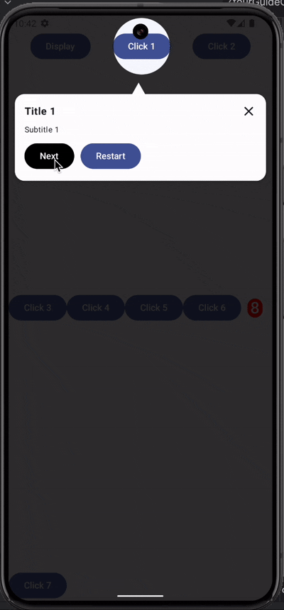

# ZTourGuide

A sleek, customizable onboarding app tour guide & feature highlight library for modern Android apps.
Guide your users step-by-step with overlay and tooltips.



## Installation
[](https://jitpack.io/#zeoharlem/TourGuide)
Add to your dependencies in build.gradle.kts at the app level

```bash
dependencies {
   //...................
   implementation("com.github.zeoharlem:TourGuide:{$latest-version}")
}
```

Add to your settings.gradle.kts

``` kotlin
dependencyResolutionManagement {
    repositoriesMode.set(RepositoriesMode.FAIL_ON_PROJECT_REPOS)
    repositories {
        google()
        mavenCentral()
        maven { url = uri("https://jitpack.io") } 👈
    }
}
```

## Usage

```kotlin


//set the list of steps you want to target
val zTourGuideSteps = listOf(
        ZTourGuideStep(
            "player1",
            DisplayProperty(
                title = "Title 1",
                subTitle = "Subtitle 1",
            )
        ),
        ZTourGuideStep(
            "player2",
            DisplayProperty(
                title = "Title 2",
                subTitle = "Subtitle 2",
            )
        ),
        ZTourGuideStep(
            "player3",
            DisplayProperty(
                title = "Title 3",
                subTitle = "Subtitle 3",
            ), onNextEvent = {
                println("Possible last guide. do something here")
            }
        ),
    )

//MainActivity or any parent component
override fun onCreate(savedInstanceState: Bundle?) {
        super.onCreate(savedInstanceState)
        enableEdgeToEdge()
        setContent {
            TourGuideTheme {
                var showZeoTourGuide by remember {
                    mutableStateOf(true)
                }

                val positions = remember { mutableStateMapOf<String, Rect>() }
                val manager = remember { ZtourGuidePlayManager(zTourGuideSteps) }

                Scaffold(modifier = Modifier.fillMaxSize()) { innerPadding ->
                    Box(modifier = Modifier.fillMaxSize()) {
                        Row(
                            modifier = Modifier
                                .fillMaxWidth()
                                .padding(innerPadding),
                            horizontalArrangement = Arrangement.SpaceEvenly
                        ) {
                           /*-- this button displays the tour guide should it gets to the end. 
                           the button component was never wrapped with ZtourGuideWrapper and 
                           it's used to change the status of the showZeoTourGuide for this use case 
                           --- */
                            Button({
                                showZeoTourGuide = true
                            }) { Text(text = "Display") }
                            /*---- ends ---*/
                            
                            /* ZtourGuideWrapper is the container for the target component */
                            ZtourGuideWrapper("player1", positionMap = positions) {
                                Button({}) { Text(text = "Click 1") }
                            }

                            ZtourGuideWrapper("player2", positionMap = positions) {
                                Button({}) { Text(text = "Click 2") }
                            }
                        }

                        Row(
                            modifier = Modifier
                                .fillMaxWidth()
                                .align(Alignment.Center)
                        ) {

                            ZtourGuideWrapper("player3", positionMap = positions) {
                                Badge(
                                    modifier = Modifier.padding(10.dp),
                                    containerColor = Color.Red,
                                    contentColor = Color.White
                                ) { Text(text = "8", fontSize = 25.sp) }
                            }
                        }


                        val targetRect = positions[manager.currentTourStep?.targetKey]

                        if (showZeoTourGuide) {
                            //ZtourGuideOverlayPlayer displays the tour guide
                            ZtourGuideOverlayPlayer(
                                manager = manager,
                                targetCoordinates = targetRect,
                                onDismiss = { showZeoTourGuide = false }
                            ) {
                                showZeoTourGuide = false
                            }
                        }
                    }
                }
            }
        }
    }

```
## ZtourGuide Configuration [optional]
#### with this configuration, you overwrite the default UIs for each component

```kotlin
val ztourGuideConfig = ZtourGuideConfig(
    titleText = { Text(it, fontWeight = Bold) },
    descriptionText = { Text(it, fontSize = 12.sp) },
    showPrevBtn = false,
    nextBtn = {
        Button(
            onClick = {
                if (manager.isLastStep()) showZeoTourGuide = false
                else manager.nextStep()
            },
            colors = buttonColors(containerColor = Color.Black)
        ) { Text(if (manager.isLastStep()) "Finish" else "Next") }
    },
)
```

### if the zTourGuide is configured, you will pass it in like this
```kotlin
//........... initial here .......//
if (showZeoTourGuide) {
    //ZtourGuideOverlayPlayer displays the tour guide
    ZtourGuideOverlayPlayer(
        manager = manager,
        targetCoordinates = targetRect,
        ztourGuideConfig = ztourGuideConfig,//👈
        onDismiss = { showZeoTourGuide = false }
    ) {
        showZeoTourGuide = false
    }
}
```

## ZtourGuide Components

- ZTourGuideStep: tour guide object property with unique keys
- ZtourGuideWrapper: target component wrapper. it's uses the keys in ZTourGuideStep
- ZtourGuideConfig: used to configure display/ui components
- ZtourGuidePlayManager: manages the ZtourGuideStep
- ZtourGuideOverlayPlayer: renders the ztourguide

## Note
#### Add enableEdgeToEdge() for android 15+
```kotlin
enableEdgeToEdge()
```

## Contributing

Pull requests are welcome. For major changes, please open an issue first
to discuss what you would like to change. kindly star and fork at will

## License

MIT License

Copyright (c) [2025] Theophilus Alamu

Permission is hereby granted, free of charge, to any person obtaining a copy
of this software and associated documentation files (the "Software"), to deal
in the Software without restriction, including without limitation the rights
to use, copy, modify, merge, publish, distribute, sublicense, and/or sell
copies of the Software, and to permit persons to whom the Software is
furnished to do so, subject to the following conditions:

The above copyright notice and this permission notice shall be included in all
copies or substantial portions of the Software.

THE SOFTWARE IS PROVIDED "AS IS", WITHOUT WARRANTY OF ANY KIND, EXPRESS OR
IMPLIED, INCLUDING BUT NOT LIMITED TO THE WARRANTIES OF MERCHANTABILITY,
FITNESS FOR A PARTICULAR PURPOSE AND NONINFRINGEMENT. IN NO EVENT SHALL THE
AUTHORS OR COPYRIGHT HOLDERS BE LIABLE FOR ANY CLAIM, DAMAGES OR OTHER
LIABILITY, WHETHER IN AN ACTION OF CONTRACT, TORT OR OTHERWISE, ARISING FROM,
OUT OF OR IN CONNECTION WITH THE SOFTWARE OR THE USE OR OTHER DEALINGS IN THE
SOFTWARE.